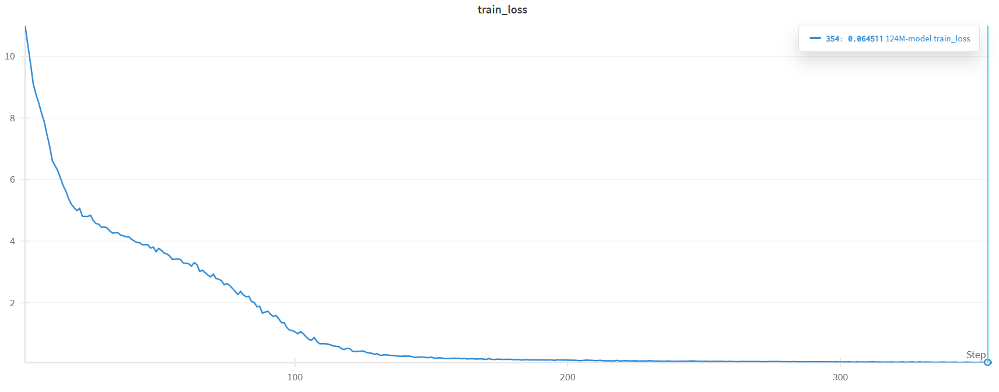
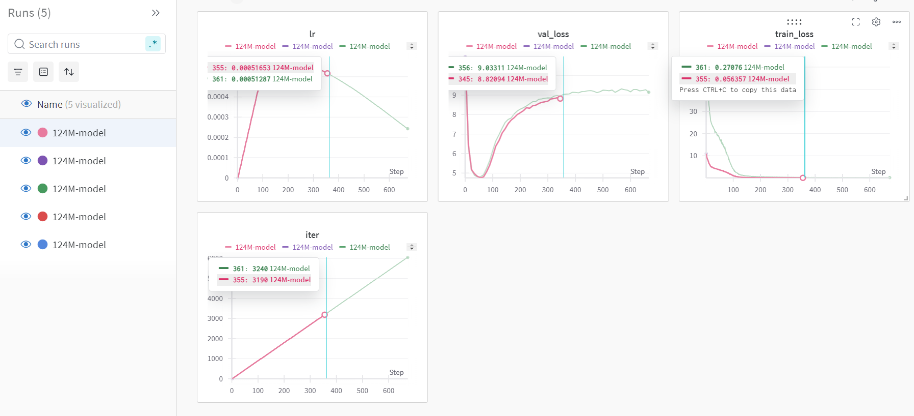

# Shakespeare GPT

A decoder-only transformer model (124M parameters) trained on Shakespeare's works. The model achieved a minimum loss of 0.064 after training on an NVIDIA L40S GPU.

🎭 **Try it out**: [Shakespeare GPT Space](https://huggingface.co/spaces/Saiteja/shakespeare-gpt)

## Training Results



Experiments🧮




- Best training loss: 0.064
- Training environment: Lightning.ai Studio with NVIDIA L40S GPU
- Training visualizations: [Weights & Biases Dashboard](https://wandb.ai/macharlasaiteja/shakespeare-gpt/runs/3pr6gpfk?nw=nwusermacharlasaiteja)
- Model weights and code: [Lightning.ai Studio](https://lightning.ai/saitej/era/studios/era-session-12/web-ui)

## Model Architecture

- 12 transformer layers
- 12 attention heads
- 768 embedding dimension
- Flash attention for performance
- Dropout (0.2) for regularization
- Bias terms enabled
- Weight decay (0.1)

## Training Configuration

- Batch size: 48 (optimized for L40S GPU)
- Gradient accumulation steps: 1
- Learning rate: 6e-4 with cosine decay
- Training iterations: 10,000
- Warmup steps: 1,000
- Gradient clipping: 1.0
- AdamW optimizer (β1=0.9, β2=0.95)
- Memory optimizations:
  - TF32 enabled
  - Reduced sequence length (512)
  - Optimized batch size for L40S

## Setup

1. Install dependencies:
```bash
pip install -r requirements.txt
```

2. Sign up for Weights & Biases (wandb.ai) and login:
```bash
wandb login
```

3. Ensure you have the input.txt file in the root directory.

## Training

Run the training script:
```bash
python train.py
```

The script will:
- Initialize a 124M parameter GPT model
- Train on the Shakespeare dataset
- Log metrics to Weights & Biases
- Save checkpoints and the best model
- Generate sample text periodically

## Monitoring

Visit your Weights & Biases dashboard to monitor:
- Training loss
- Learning rate schedule
- Generated text samples
- Hardware utilization metrics

## Checkpoints

The script saves:
- Regular checkpoints every 1000 iterations in `checkpoint_{iter}.pt`
- Best model based on validation loss in `best_model.pt`

## Final model

- `checkpoint_3000.pt`  (model weights accessible in lightning.ai studio)

## Hugging Face Spaces Deployment

1. Create a new Space on Hugging Face:
   - Go to huggingface.co/spaces
   - Click "Create new Space"
   - Choose "Gradio" as the SDK
   - Set the Space as "Public"

2. Upload the following files to your Space:
   - `train.py`: Model architecture and training code
   - `app.py`: Gradio interface for text generation
   - `requirements.txt`: Dependencies
   - `checkpoint_3000.pt`: Your trained model checkpoint

3. The Gradio app provides:
   - Interactive text generation interface
   - Adjustable parameters:
     - Max length (10-500 tokens)
     - Temperature (0.1-2.0)
     - Top-k sampling (1-100)
   - Example prompts from Shakespeare's works
   - Real-time text generation


## Links

- Training Dashboard: [Weights & Biases](https://wandb.ai/macharlasaiteja/shakespeare-gpt/runs/3pr6gpfk?nw=nwusermacharlasaiteja)
- Model & Code: [Lightning.ai Studio](https://lightning.ai/saitej/era/studios/era-session-12/web-ui)
- Live Demo: [Shakespeare GPT Space](https://huggingface.co/spaces/Saiteja/shakespeare-gpt) 